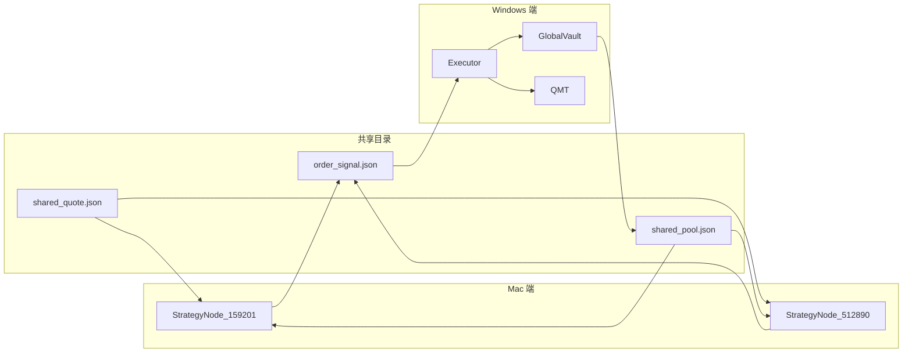

# 双标的共享资金池网格交易系统 — 开发文档 (QMT/Python)

> 当前实盘仅启用 **159201 自由现金流 单标策略**；本文档描述的双标方案（159201 + 512890）暂作为扩展设计保留，方便未来需要时启用或参考。

本文档在单标的（159201）架构基础上，增加 512890 与共享物理资金池，形成双标的一体化设计规格。与 [开发文档_完整版.md](开发文档_完整版.md) 并列，供开发参考。

**实现状态**：Windows 端已实现 [global_vault.py](global_vault.py)（单例 + 文件锁），[order_executor.py](order_executor.py) 已扩展双标的与 Vault 审批（ALLOWED_CODES 含 512890.SH，买入前 request_allocation、成交后 on_fill、卖出成功后按 release_client_order_ids 调用 release、失败/撤单 on_cancel）。Mac 端 [mac_dashboard.py](mac_dashboard.py) 已实现双标策略与 shared_pool 读取（步长惩罚、15% 拦截、client_order_id 链路、release_client_order_ids）。

---

## 一、核心架构设计

系统由三部分组成：

| 端 | 组件 | 职责 |
|----|------|------|
| **Windows（QMT）** | 全局资金管理器 **GlobalVault** | 维护物理资金池占用、跨策略审批、写入 shared_pool.json |
| **Mac** | 独立策略逻辑 **StrategyNodes** | 159201 与 512890 两套策略节点，各自算信号，共享物理池视图 |
| **Windows（QMT）** | **Executor** | 在现有 [order_executor.py](order_executor.py) 上扩展：读信号、Vault 审批/预检、QMT 下单 |

与单标的差异：物理池唯一（300,000 元），两标的名义限额各 200,000 元，通过动态分配实现资金复用。

### 1.1 数据流概览



- **shared_quote.json**：行情 + 持仓，由 [bridge_producer.py](bridge_producer.py) 写入，Mac 策略节点读取。
- **shared_pool.json**：物理池占用（各标的已用金额），由 GlobalVault 写入，Mac 读作「是否允许新开第一层 / 是否放大步长」。
- **order_signal.json**：买卖信号，Mac 写入，Executor 读后审批、下单、消费。

---

## 二、资金分配模型

- **物理资金池 (Physical Pool)**：300,000 元，实盘总可用现金；由 GlobalVault 在 Windows 端维护（或从 QMT 查询后汇总）。
- **名义限额 (Nominal Cap)**：159201 设为 200,000 元；512890 设为 200,000 元；两标的不共享名义额度，但共享物理池。
- **杠杆逻辑**：利用两标的同时触底概率低的特性，通过「按请求审批、物理池剩余不足时拒绝新开第一层」实现资金复用与动态分配。

---

## 三、全局资金管理器 (GlobalVault)

### 3.1 位置与形态

在 **SharedContext** 中维护全局单例；Windows 端为权威源。跨进程时通过共享文件 `shared_pool.json` 同步，供 Mac 读取。

### 3.2 冻结资金 (Frozen Cash) 逻辑

实盘中下单到成交之间存在时间差，若仅在成交后更新占用，挂单期间另一标的可能把物理池打满，导致超配或拒绝失效。GlobalVault 内部应区分：

- **已占用 (Used)**：已成交订单对应的资金，计入各标的 `used_*`。
- **冻结中 (Frozen)**：信号已发出、订单已报出但尚未成交或撤单的金额，计入各标的 `frozen_*`。

流程建议：

1. **信号发出、Executor 报单前**：调用 `request_allocation(symbol, amount, layer_index, client_order_id)`，先将 `amount` 划入该标的的 **frozen**，参与「物理池剩余 ≥ 15%」等校验（used + frozen 合计不超过池子约束）。
2. **QMT 返回成交回报**：将该笔 `client_order_id` 对应的金额从 frozen 转入 used，并保留在「ID → 金额」映射中，供平仓时精准 release。
3. **QMT 返回撤单/废单**：将该笔 `client_order_id` 对应的金额从 frozen 中释放，不转入 used。

这样在挂单期间，物理池的「已承诺」部分（used + frozen）已被锁定，避免双标的同时触底时瞬时打满。

### 3.3 职责与接口建议

- **request_allocation(symbol, amount, layer_index, client_order_id)**：申请占用；先将 amount 划入该标的 **frozen**；layer_index==0 表示新开第一层，需满足「(used + frozen) 合计后物理池剩余 ≥ 15%」。内部记录 `client_order_id → amount`。
- **on_fill(symbol, client_order_id)**：成交回报到达时，将对应金额从 frozen 转入 used，保留 ID→amount 映射。
- **on_cancel(symbol, client_order_id)**：撤单/废单时，释放该 ID 对应的 frozen，删除映射。
- **release(symbol, client_order_id)** 或 **release(symbol, amount)**：平仓时按 **client_order_id** 释放该笔当时申请的金额（从 used 及映射中移除），避免按当前市值释放导致的价格波动误差累计。
- **get_used_map()** / **get_frozen_map()**：返回各标的 used、frozen，用于写入 `shared_pool.json`。

### 3.4 与现有执行器关系

[order_executor.py](order_executor.py) 在执行前：先做现有「可用资金预检」，再向 GlobalVault 申请额度（或读取 shared_pool 后本地判断）。顺序：**幂等 → 校验 → 资金预检 → Vault 审批 → 下单 → 消费**。Vault 拒绝时：消费信号、写 order_result、不下单。

---

## 四、标的策略参数适配

### 4.1 512890（红利低波 ETF）— cooling_off 优化版

核心逻辑：关闭冷静期以提升频率，采用均权。详见 [策略文档_512890.md](策略文档_512890.md) 与 [mac_backtest_512890.py](mac_backtest_512890.py) 默认/cooling_off。

| 参数 | 值 | 说明 |
|------|-----|------|
| ATR_GRID_FACTOR | 0.32 | 网格弹性系数 |
| GRID_STEP_FLOOR | 0.001 (0.10%) | 步长下限 |
| COOLING_ENABLED | False | 关闭冷静期 |
| 层权 (Pyramid) | (1,1,1,1,1,1,1,1,1) | 均权 9 层 |

目标指标：年化笔数约 216 笔，Alpha 约 11,657 元，回撤控制在 -0.8% 以内。

### 4.2 159201（现金流 ETF）

核心逻辑：标准 ATR 动态网格。详见 [策略文档_159201.md](策略文档_159201.md) 与 [开发文档_完整版.md](开发文档_完整版.md) 表 3.2。

| 参数 | 值 | 说明 |
|------|-----|------|
| ATR_GRID_FACTOR | 0.38 | 网格弹性系数 |
| GRID_STEP_FLOOR | 0.0012 (0.12%) | 步长下限 |
| 层权 | (1,1,1,1,1,1,1,1,1) | 均权 9 层 |

Mac 端若实现双标的，每个 StrategyNode 独立计算信号，共享「物理池占用」视图（通过读 `shared_pool.json`）。

---

## 五、关键风险控制逻辑

### 5.1 优先级与冲突解决

- 当**物理池剩余 < 15%**（即 **used + frozen** > 255,000 元）时：**禁止两标的的新开第一层（Layer 0）**；仍允许已持仓层数的卖出平仓请求，以释放流动性。
- 实现位置：GlobalVault 或 Executor 侧；若在 Executor，需区分「开新仓」与「加仓/平仓」，仅对「开新仓」做 15% 校验。

### 5.2 动态步长惩罚与迟滞区间

- 若**总资金占用（used + frozen）> 270,000 元**（90%）：将所有**买入**网格步长（grid_step）**临时扩大 50%**（更难触发新买）。
- **迟滞区间 (Hysteresis)**：为防止在 90% 附近「步长频繁跳变」导致策略逻辑震荡，引入迟滞：**占用 > 90% 时触发惩罚**；**只有当占用跌回 < 85% 时才取消惩罚**。即 85%～90% 之间保持当前状态（已触发则继续惩罚，已取消则继续不惩罚），使极端行情下策略更稳健。
- 建议在 **Mac 策略节点** 读 `shared_pool.json` 占用率后本地做 90% 触发 / 85% 解除判断并放大步长，与回测逻辑一致；Executor 侧可仅做拒绝不修改步长。

### 5.3 单周期止损

- 任意品种单周期浮亏超过 **15,000 元**（基于 20 万流动仓）：执行强制减仓逻辑。
- 与 [mac_backtest_512890.py](mac_backtest_512890.py) 中 `MAX_CYCLE_FLOAT_LOSS`、`ENABLE_FLOAT_LOSS_STOP` 对齐。实盘启用时可由 Mac 用实时持仓+行情计算浮亏，或 Windows 用持仓+最新价；文档建议在规格中明确由哪一端计算并触发。

---

## 六、执行器实现 (QMT 侧)

### 6.1 扩展点（基于 order_executor.py）

- **标的扩展**：`ALLOWED_CODES` 增加 `512890.SH`。
- **资金预检**：除 QMT 可用资金外，增加「GlobalVault 审批」或「读取 shared_pool.json 校验物理池剩余」。
- **新开第一层**：若物理池剩余 < 15%，拒绝并消费信号、写 order_result。

### 6.2 QMT 侧逻辑片段（伪代码）

```python
# 读取 shared_pool.json
SHARED_POOL_PATH = os.path.join(SHARED_DIR, 'shared_pool.json')
PHYSICAL_POOL = 300_000
MIN_RESERVE_RATIO = 0.15   # 剩余 15% 禁止新开 Layer 0

def can_open_new_layer(symbol, amount):
    # 占用 = 已成交(used) + 冻结中(frozen)，避免挂单期间被另一标的打满
    committed = get_used_total() + get_frozen_total()
    if committed + amount > PHYSICAL_POOL * (1 - MIN_RESERVE_RATIO):
        return False
    return True
```

信号中需携带「是否为新开第一层」（例如 `layer_index` 或 `is_first_layer`），供 Executor 判断是否走 15% 校验。

### 6.3 信号唯一性与 ID 链路

双标的环境下信号冲突管理更关键，每个信号必须：

- 携带全局唯一的 **client_order_id**（如 uuid4.hex 或 snowflake），与现有 `signal_id` 可一致或一一对应。
- 在 **order_signal.json** 中显式写出：`client_order_id`、`code`、`direction`、`price`、`shares`、`amount`（本笔申请占用金额）、`layer_index` 等。

GlobalVault / shared_pool 侧：

- 在 **shared_pool.json** 或 Vault 内部记录「**client_order_id → 金额**」的映射（或按标的维护 `allocations_159201`、`allocations_512890` 列表，每项含 `client_order_id` 与 `amount`）。
- **release** 接口按 **client_order_id** 查找该笔当时申请的金额并释放，确保平仓时释放的是「当时占用」而非按当前市值反算，避免价格波动导致 used 与真实持仓市值偏差累计。

**order_signal.json 双标格式（Executor 约定）**：Mac 写入信号时建议包含以下字段，便于 Vault 与 ID 链路生效；未提供时 Executor 使用默认值。

| 字段 | 必填 | 默认 | 说明 |
|------|------|------|------|
| signal_id | 是 | — | 幂等与消费用 |
| client_order_id | 否 | signal_id | Vault 与 release 用，买入时与 signal_id 一致，供 request_allocation/on_fill |
| code | 是 | — | 159201.SZ / 512890.SH |
| direction | 是 | — | BUY / SELL |
| price | 是 | — | 限价 |
| shares | 是 | — | 股数（100 的整数倍） |
| amount | 否 | price×shares | 本笔申请占用金额（元），买入时用于 request_allocation |
| layer_index | 否 | 0 | 0=新开第一层（走 15% 校验），>0=加仓 |
| release_client_order_ids | 否 | — | 卖出时：待释放的 BUY 的 client_order_id 列表，Executor 按此调用 release |

---

## 七、环境与持久化（Mac mini 适配）

### 7.1 状态同步

- Vault 将 **used_map**、**frozen_map** 以及 **acc_alpha_159201 / acc_alpha_512890** 实时或定期写入 **shared_pool.json**（路径与 `SHARED_DIR` 一致）。
- Mac 端 [mac_dashboard.py](mac_dashboard.py)（或未来双标 dashboard）读取后用于：
  - 展示物理池占用率（used + frozen）；
  - 动态步长惩罚（占用 > 90% 时步长 ×1.5，占用 < 85% 时取消，迟滞见 5.2）；
  - 是否允许新开第一层（剩余 < 15% 禁止）；
  - 两路 Alpha 累计收益的实时展示（赛跑）。

### 7.2 shared_pool.json 约定

| 字段 | 类型 | 说明 |
|------|------|------|
| used_159201 | number | 159201 已占用金额（元），已成交占用 |
| used_512890 | number | 512890 已占用金额（元），已成交占用 |
| frozen_159201 | number | 159201 冻结中金额（元），挂单未成交 |
| frozen_512890 | number | 512890 冻结中金额（元），挂单未成交 |
| acc_alpha_159201 | number | 159201 累计 Alpha 收益（元），便于 Mac 端展示两路收益「赛跑」 |
| acc_alpha_512890 | number | 512890 累计 Alpha 收益（元） |
| updated_at | string | 最后更新时间（ISO8601） |

可选：Vault 内部或持久化中维护 **client_order_id → amount** 映射（可按标的存为 `allocations_159201`、`allocations_512890` 数组），用于 release 时按单笔精准释放；若仅存 used/frozen 合计，则 release 时需按 client_order_id 查找对应金额再扣减。

示例：

```json
{
  "used_159201": 120000,
  "used_512890": 80000,
  "frozen_159201": 0,
  "frozen_512890": 22000,
  "acc_alpha_159201": 3500.50,
  "acc_alpha_512890": 2100.00,
  "updated_at": "2026-02-16T12:00:00"
}
```

### 7.3 数据采集

- **512890**：Windows 端 QMT 通过 [fetch_quote_512890.py](fetch_quote_512890.py) 生成 1 分钟 CSV，供 Mac 分析与回测。
- **159201**：沿用现有 [bridge_producer.py](bridge_producer.py) 的 shared_quote 行情。

### 7.4 共享目录

与现有一致：Windows `C:\Mac\Home\Documents\miniqmt`，Mac 同步后同目录。

---

## 八、恢复与容错

- 双标的下 Vault 状态与 shared_pool 不一致时：以 Windows 端 QMT 持仓与 Vault 为准；Mac 重启后从 dashboard_state 恢复策略状态，并重新读取 shared_pool。详见 [实盘恢复与容错说明.md](实盘恢复与容错说明.md)。

---

## 九、文档与版本

- 与 [开发文档_完整版.md](开发文档_完整版.md) 及代码同步更新；策略细节见 [策略文档_512890.md](策略文档_512890.md)、[策略文档_159201.md](策略文档_159201.md)。
